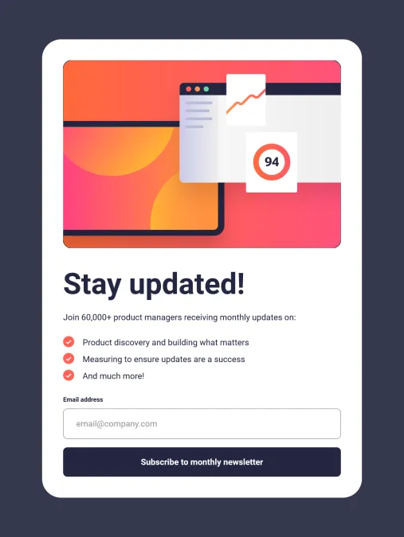

# Frontend Mentor - Newsletter sign-up form with success message solution

This is a solution to the [Newsletter sign-up form with success message challenge on Frontend Mentor](https://www.frontendmentor.io/challenges/newsletter-signup-form-with-success-message-3FC1AZbNrv). Frontend Mentor challenges help you improve your coding skills by building realistic projects.

## The challenge

Users should be able to:

- Add their email and submit the form
- See a success message with their email after successfully submitting the form
- See form validation messages if:
  - The field is left empty
  - The email address is not formatted correctly
- View the optimal layout for the interface depending on their device's screen size
- See hover and focus states for all interactive elements on the page

### Screenshot

Desktop


Tablet



Mobile


### Links

- Solution URL: [https://www.frontendmentor.io/solutions/newsletter-sign-up-form-using-sass-and-justvalidate-KkbBuAWA3n](https://www.frontendmentor.io/solutions/newsletter-sign-up-form-using-sass-and-justvalidate-KkbBuAWA3n)
- Live Site URL: [https://nuzaty.github.io/fm-10-newsletter-signup/](https://nuzaty.github.io/fm-10-newsletter-signup/)

## My process

### Built with

- Semantic HTML5 markup
- Flexbox
- CSS Grid
- Mobile-first workflow
- [Sass (Dart Sass)](https://sass-lang.com/)
- [BEM](https://getbem.com/)
- JS
- [JustValidate](https://just-validate.dev/)

### CSS build

Install [Dart Sass](https://sass-lang.com/install/#install-standalone) or Sass (one-time):

```
npm install -g sass
```

Dev:

```
sass --watch scss:dist
```

Build:

```
sass scss:dist
```
